# Detect AI-Generated Korean Text via KoBERT by Building Custom Dataset

### 한양대학교 2024년 2학기 AI+X:딥러닝 과목 프로젝트   
기계공학부 2018013309 김승희 : 코드 작성 / 커스텀 데이터셋 구축 / 실험 / 결과 분석 / 블로그 작성
기계공학부 2018014002 유용준 : 데이터셋 조사 / 관련 기업 조사 / 선행 연구 조사 / 데이터셋 전처리 / 데이터 분석

## 1. Introduction
### 1.1 한국어 AI 생성 텍스트 탐지 기술의 중요성  
인공지능의 발전은 글쓰기, 콘텐츠 생성, 질문 응답 등 다양한 분야에서 영향력을 넓혀가고 있다. 특히, 대형 언어 모델(Large Language Model, LLM)은 텍스트 생성에 있어 뛰어난 성능을 보여주며 주목받고 있다. 그러나 이러한 기술의 무분별한 사용은 표절, 허위 정보 생성, 가짜 뉴스, 스팸 확산과 같은 심각한 문제를 초래한다. 이에 따라 AI가 생성한 텍스트를 신뢰성 있게 감지할 수 있는 기술의 필요성이 점차 대두되고 있다.  

해외에서는 이와 같은 AI 생성 텍스트 감지 기술의 중요성이 부각되면서 관련 기업의 설립 및 기술 경진 대회, 연구가 활발히 이루어지고 있다. 하지만 한국어와 관련해서는 아직 관련 기업이나 데이터셋이 전무하며, 연구 또한 초기 단계에 머물러 있는 상황이다.

이러한 배경에서, 한국어로 작성된 AI 생성 텍스트를 감지하기 위한 학습 데이터셋을 직접 구축하고, 이를 활용하여 한국어 AI 생성 텍스트 판별 모델 개발을 진행하고자 한다.

## 2. Related Work

### 2.1 AI-Generated Text Detection 서비스 기업

- **ZeroGPT**  
   [ZeroGPT 웹사이트](https://www.zerogpt.com/)  
   ZeroGPT는 GPT-3, LLaMA, Google Bard와 같은 AI 모델이 생성한 콘텐츠를 감지하는 도구이다. 한국어도 지원하지만, 학습 데이터가 주로 영어 중심이라 한국어에 대한 정확도가 매우 낮다.

- **GPTZero**  
   [GPTZero 웹사이트](https://gptzero.me/)  
   GPTZero 역시 모든 언어를 지원한다고 하나, 한국어에 대한 정확도는 낮다는 피드백이 많다. 특히, 한글 콘텐츠가 AI 생성이라고 잘못 판단하는 경우(거짓 양성)가 자주 발생한다.

- **OpenAI - AI Text Classifier**  
   [OpenAI AI Classifier](https://openai.com/index/new-ai-classifier-for-indicating-ai-written-text/)  
   OpenAI는 AI 텍스트 분류기의 정확도가 낮다고 경고하고 있으며, 현재는 사용 불가 상태이다. 이 분류기는 주로 영어 텍스트에 사용되는 것이 좋으며, 9%의 거짓 양성(FP) 오류를 가질 수 있어 AI 생성 텍스트와 인간 텍스트 간의 차이를 정확하게 구별하는 것이 매우 어려운 일임을 알 수 있다.

### 2.2 AI-Generated Text Detection 논문

- **Can AI-Generated Text be Reliably Detected?**  
   [논문 링크](https://ar5iv.labs.arxiv.org/html/2303.11156)  
   이 논문은 대형 언어 모델(LLMs)로 생성된 텍스트의 탐지가 패러프레이징(재구성)에 취약하며, 탐지 성능이 랜덤 분류기 수준으로 떨어질 수 있다는 것을 입증한다. 특히 AI 생성 텍스트의 탐지 한계는 특정 글쓰기 스타일이나 고의적 조작까지도 가능하게 만든다고 설명한다. 또한, 워터마킹이 적용된 모델도 공격에 취약하다는 점을 강조하고 있다.

- **Safeguarding Authenticity in Text with BERT-Powered Detection of AI-Generated Content**  
   [논문 링크](https://ieeexplore.ieee.org/document/10544590)  
   이 논문은 BERT 모델을 활용하여 AI 생성 텍스트를 식별하는 방법을 제시한다. BERT의 문맥적 임베딩을 분석하여 AI와 인간 작성 텍스트를 구별할 수 있는 성능을 입증한다.

### 2.3 AI-Generated Text Detection 기술 경진대회

- **Kaggle: LLM - Detect AI Generated Text**  
   [대회 링크](https://www.kaggle.com/competitions/llm-detect-ai-generated-text)  
    이 대회는 언어 모델로 생성된 텍스트를 탐지하는 경진 대회로, 영어 데이터셋을 활용해 진행되었다. 그러나 한국어와 같은 비영어권 언어에 대한 고려가 부족하여, 해당 데이터셋 및 대회 내용을 한국어 텍스트 탐지에 직접적으로 적용하기 어렵다.   

이와 같이 기존의 AI 탐지 기술 및 연구는 주로 영어를 중심으로 이루어져 있으며, 한국어 데이터셋의 부재와 한국어 탐지 모델 부재라는 명확한 한계점이 존재한다. 이는 **한국어 AI 생성 텍스트 탐지를 위한 데이터셋 구축 및 모델 개발**이라는 본 연구 프로젝트의 필요성을 더욱 부각시킨다.

## 3. Custom Ko-Detect-AI-Dataset-v1 Construction
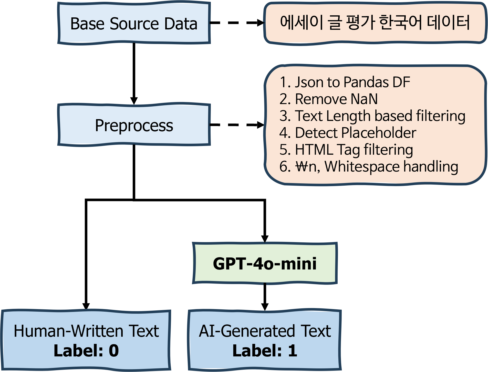
[Ko-Detect-AI-Dataset-v1 Generation Pipeline Figure]  

- 한국어 AI Generated Text 분류 데이터셋이 존재하지 않기 때문에 직접 구축하고, **Ko-Detect-AI-Dataset-v1**로 명명한다.
- 한국어로 이뤄진 Base Source 자연어 데이터셋을 구하고, 해당 데이터를 GPT-4o-mini 등의 LLM으로 재구성해서 AI Generated Text / Human Written Text 이진 분류 데이터셋을 구축한다.
- 3.1~3.3에 해당하는 코드는 [`1_dataset_preprocess.ipynb`](./1_dataset_preprocess.ipynb)에서 확인할 수 있다.
  
### 3.1 Base Source Data 
- AI-Hub의 [에세이 글 평가 데이터](https://aihub.or.kr/aihubdata/data/view.do?currMenu=115&topMenu=100&dataSetSn=545) 를 Base Source Data로 활용
- 해당 데이터셋은 초등, 중등, 고등학생 등 다양한 학년군의 에세이 및 에세이 평가 점수로 구성된 데이터로, 에세이는 전문가의 자문을 통해 구성된 50가지 주제로 구성되어 있다.
- 'essay_type'으로 글짓기, 대안제시, 설명글, 주장, 찬성반대 등이 존재한다.

### 3.2 Base Source Dataset Preprocess
1. JSON to Pandas Dataframe: Raw JSON 파일에서 필요한 정보만 뽑아서 통합한 후, Pandas dataframe으로 변환하는 전처리 단계
2. 데이터셋 결측치 제거 전처리
3. paragraph_txt의 길이 계산한 후 분포 확인, 너무 짧거나 긴 경우 제거하는 전처리  
  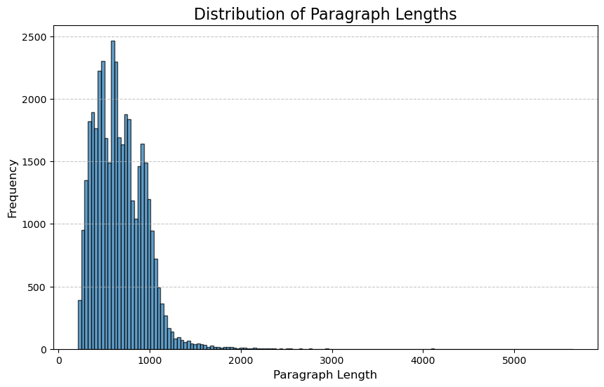
4. Detect Placeholder: #@이름#, #@소속# 등의 태그를 추출하고, 해당 태그가 있는 경우에는 해당 데이터를 제거해주는 전처리
5. HTML 태그 제거 전처리
6. 'essay_prompt' 전처리: \n 및 공백 전처리

### 3.3 Split Train & Valid & Test Dataset
- 글짓기, 대안제시, 설명글, 주장, 찬성반대 5개의 에세이 타입이 존재하고, 초등, 중등, 고등학생으로 나뉘기 때문에 균등한 분포를 위해서 Train & Valid & Test 데이터셋에 대해 동일한 양을 설정한다. 
- 이 데이터셋은 추후 Human-Written Text가 되고 Label이 0을 부며하며, 추후 AI-Generated Text를 생성할 때의 Input이 된다.

- Train Dataset: 4500개 (초,중,고 별로 300개씩)  
    글짓기(900), 대안제시(900), 설명글(900), 주장(900), 찬성반대(900)

- Validation Dataset: 450개 (초,중,고 별로 30개씩)  
    글짓기(90), 대안제시(90), 설명글(90), 주장(90), 찬성반대(90)

- Test Dataset: 450개 (초,중,고 별로 30개씩)  
    글짓기(90), 대안제시(90), 설명글(90), 주장(90), 찬성반대(90)

### 3.4 Generate AI-Generated Text
- OpenAI의 GPT-4o-mini 모델의 API를 활용하여 AI-Generated Text를 생성하고, Label 1을 부여한다.
- 3.4~3.5에 해당하는 코드는 [`2_build_custom_dataset_AI_Generated_Text.ipynb`](./2_build_custom_dataset_AI_Generated_Text.ipynb)에서 확인할 수 있다.

### 3.5 Human-Written Text vs AI-Generated Text Analysis
1. Length 비교
  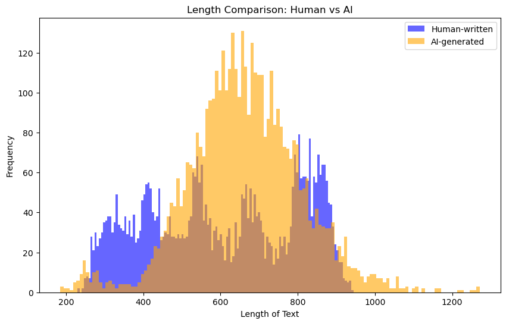
  - Human-Written Text과 AI-Generated Text의 Text Length를 비교하였다.
  - 고루 분포되어 있는 Human-Written Text와 달리, AI-Generated Text는 600~800 사이의 Length를 가지는 경우가 많다는 것을 알 수 있다.
2. 사용 빈도가 높은 단어 Top 20 비교 (공백 기준으로 단어 분리)
  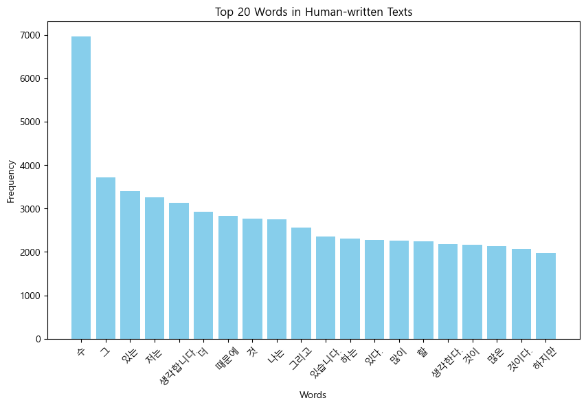
  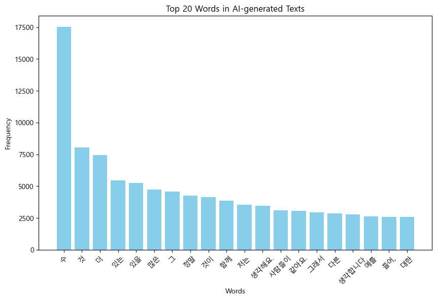
  - 공백 기준으로 단어를 분리하여, 사용 빈도가 높은 단어를 비교하였다.
  - Human-Written Text의 경우 '저는', '생각합니다', '때문에' 등의 단어 사용 빈도가 높은 반면, AI-Generated Text의 경우 '많은', '정말', '함께' 등의 단어 사용 빈도가 높다는 것을 알 수 있다.
3. 사람만 쓰는 단어 VS AI만 쓰는 단어 (공백 기준으로 단어 분리)
  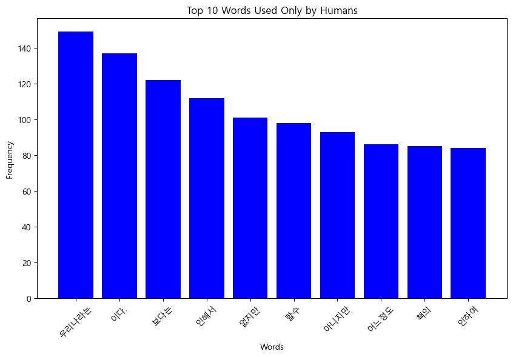
  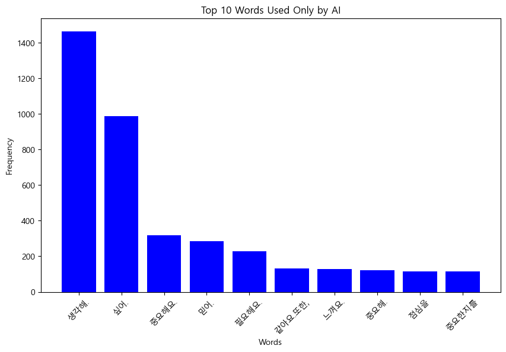
  - 공백 기준으로 단어를 분리하여, 오직 사람만 사용한 단어와 AI만 사용한 단어를 추출했다.
  - '우리나라는', '인해서', '없지만', '아니지만' 등의 단어는 오직 사람만 사용했다는 것을 확인할 수 있다.

## 4. Methods
- 직접 제작한 **Ko-Detect-AI-Dataset-v1** 데이터셋은 0 또는 1로 라벨링된 이진 텍스트 분류 데이터셋이다. 이를 분류하기 위해 Transformer Encoder 기반의 모델을 파인튜닝하였다.
- Encoder 기반 모델의 대표적인 예로 BERT(Bidirectional Encoder Representations from Transformers)가 있으며, 이는 다양한 NLP 태스크에서 뛰어난 성능을 보이는 모델로 널리 활용되고 있다. BERT는 텍스트의 문맥적 관계를 양방향으로 학습할 수 있는 Transformer 아키텍처를 사용하여 높은 성능을 발휘한다.
- BERT 구조를 베이스로 파생된 다양한 모델들이 존재하는데, KoBERT는 기존 BERT 모델의 한국어 성능 한계로 인해 BERT를 한글 데이터 기반으로 학습한 모델이다. 우리 데이터셋은 한글로 구성되어 있기 때문에 이 KoBERT를 baseline으로 사용했다.
- 그러나 KoBERT 자체는 공개된 지 오래된 모델이기 때문에 근본적으로 성능에 한계가 있을 가능성을 고려하여, KoBERT 외에도 여러 BERT 기반 모델을 실험에 사용하여 결과를 비교하였다.
### 다양한 실험 모델 선정
- google-bert/bert-base-uncased
- google-bert/bert-base-multilingual-cased
- skt/kobert-base-v1
- klue/roberta-small
- klue/roberta-base
- microsoft/deberta-v3-xsmall
- microsoft/deberta-v3-base
- microsoft/deberta-v3-large
- lighthouse/mdeberta-v3-base-kor-further
- team-lucid/deberta-v3-base-korean
- kykim/bert-kor-base
- kakaobank/kf-deberta-base

### 평가 Metric 선정
- 해당 이진 분류 태스크의 성능 평가는 **F1 Score**를 기준으로 이루어졌다. F1 Score는 Precision과 Recall의 조화 평균으로, 모델의 예측 성능을 종합적으로 평가하는 데 효과적인 지표이다.
- 이 때 Precision은 모델이 긍정(Positive)으로 예측한 샘플 중 실제로 긍정인 샘플의 비율을 의미하며, Recall은 실제로 긍정인 샘플 중 모델이 올바르게 긍정으로 예측한 비율을 의미한다.
### Experiments Setting
| Hyper Parameter     | Value   |
|---------------|---------|
| SEED          | 1       |
| EPOCH         | 1       |
| LR            | 5e-5    |
| WEIGHT_DECAY  | 0.01    |
| BATCH_SIZE    | 16      |
- 하이퍼 파라미터는 모든 모델에 동일하게 위 표와 같은 값을 적용시켰다.
- 실험 전부 NVIDIA A100 80GB PCIe GPU 환경에서 진행했다.

## 5. Experiments Analysis
### Ko-Detect-AI-Dataset-v1 Results
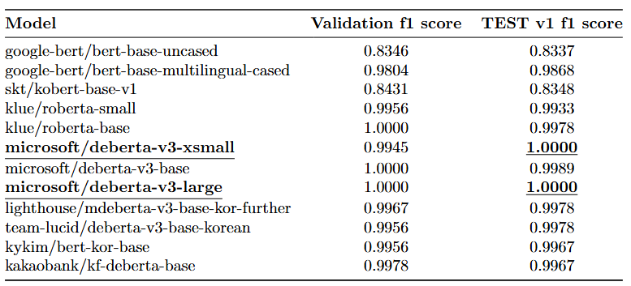
- BERT의 기본 모델인 bert-base-uncased의 경우 test dataset에 대해 F1 score 0.8337을 보였고, 한국어 데이터셋에 대해 학습된 kobert-base-v1 모델도 유사한 정확도를 보였다.
- bert-base-uncased 모델에 비해 다국어로 학습된 bert-base-multilingual-cased 모델이 훨씬 높음을 확인할 수 있다.
- skt/kobert-base-v1에 비해서 더욱 발전된 roberta, deberta 계열의 모델이 0.99이상의 F1 score를 보인다.
- 또한, deberta-v3-large 모델의 경우 validation, test 모두 f1 score 1을 달성하여 주어진 Task를 완벽히 수행하는 것을 알 수 있다.
- 5.Experiments Analysis의 코드는 [`3_train_valid_inference_v1.ipynb`](./3_train_valid_inference_v1.ipynb)에서 확인할 수 있다.
- 전반적으로 모든 모델이 우리가 구축한 데이터셋을 쉽게 해결하는 것을 분석할 수 있었고, 추가적으로 데이터셋의 난이도를 조정하는 계기가 되었다.

## 6. Additional Dataset: Ko-Detect-AI-Dataset-v2
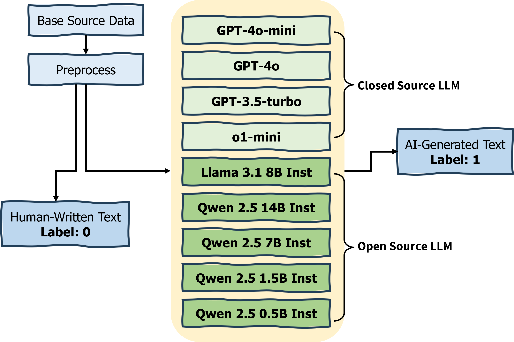  
- [Ko-Detect-AI-Dataset-v2 Generation Pipeline Figure]  

### Ko-Detect-AI-Dataset-v1의 문제점 분석
- **Ko-Detect-AI-Dataset-v1**의 경우에 AI-Generated Text가 전부 GPT-4o-mini로 구성돼서 데이터 다양성에 있어 부족한 점이 존재한다.
- 특히, Train Data와 Test Data에서 사용된 LLM이 전부 GPT-4o-mini이기에 Text의 Distribution이 유사하다. 즉, Train data에서 분류 모델이 GPT-4o-mini의 특성에 대해서 학습했기 때문에 당연히 GPT-4o-mini로 만든 Test dataset에 대해서 예측을 잘 할 수밖에 없어 f1 score가 거의 0.99에 가깝게 나오는 것과 같이 데이터셋의 분류 난이도가 쉬울 수 있다는 분석을 진행했다.
- 이에 따라서, Test dataset에 대해서 GPT-4o-mini뿐만 아니라 여러 9가지 종류의 여러 LLM들을 활용해서 AI-Generated Text를 구성했고 이를 **Ko-Detect-AI-Dataset-v2**로 명명했다.
- Train, Valid Dataset은 v1과 동일하고 Test Dataset을 다르게 구성하였다. 분류 모델은 오직 GPT-4o-mini로 이뤄진 학습 과정을 거친 후에 LLama 3.1 8b, Qwen 2.5 14B, GPT-4o 등 다양한 LLM으로 구성된 Test dataset에 대해서 예측을 하게 된다.
- 6.Additional Dataset: Ko-Detect-AI-Dataset-v2의 코드는 4_1 ~ 4_10 주피터 노트북 코드에서 확인할 수 있다.

### Ko-Detect-AI-Dataset-v2 Results
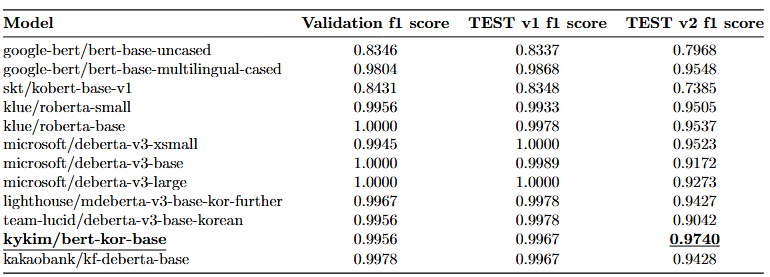
- v1 데이터셋에 비교해서 각 모델의 성능이 더 낮아지는 것을 확인할 수 있어서, 직접 구축한 데이터셋의 난이도 조절에 성공함을 보였다.
- Test v2 데이터셋의 경우 **bert-kor-base** 모델이 f1 score 0.974로 가장 높은 성능을 보였는데, 데이터셋의 난이도가 상승하게 되면 한국어로 학습된 모델이 가장 높은 성능을 보이는 것을 확인할 수 있었다.

### bert-kor-base 예측 결과 분석
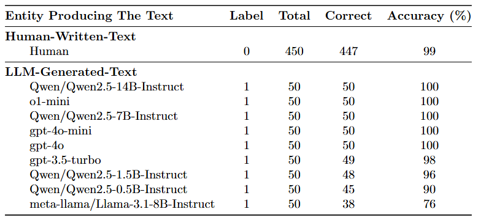
- Test v2 데이터셋에 대해서 가장 높은 정확도를 보인 **bert-kor-base** 모델의 실험 결과를 추가적으로 분석했다.
- Label이 0인 Human-Written Text의 경우에는 450개 중 447개를 맞추는 것을 알 수 있고, AI-Generated Text 중에서는 o1-mini, gpt-4o-mini, gpt-4o, gpt-3.5-turbo 등의 Closed Source Model의 정확도가 상대적으로 높은 것을 확인할 수 있다.
- 반대로, llama 3.1 8B, Qwen 2.5 0.5B 등 Open Source Model로 생성된 Text의 경우에는 정확도가 낮은 결과를 보인다.

## 7. Conclusion
- 본 프로젝트에서는 한국어 AI 생성 텍스트 탐지의 중요성을 언급하고, 이를 위한 데이터셋 **Ko-Detect-AI-Dataset-v1**과 **Ko-Detect-AI-Dataset-v2**를 직접 구축했으며 다양한 모델을 활용해 성능을 평가하였다. 
- 공개된 데이터셋을 그대로 이용하는 것이 아니라, 해당 Task에 해당하는 데이터셋이 없음을 확인하고 직접 구축했다는 점에 큰 의의가 존재한다. 
- 데이터 다양성이 탐지 모델의 일반화 성능에 중요하다는 점을 확인했으며, bert-kor-base 모델이 가장 우수한 성능을 보였다. 
- Future Work로는, 본 프로젝트를 통해 구축한 데이터셋은 특정 글 종류(에세이 글 평가 데이터)에 한정되었으나, 향후 뉴스, 소셜 미디어, 블로그와 같은 다양한 한국어 데이터셋을 구축하여 더 풍부하고 일반화된 한국어 AI 탐지 데이터셋을 구축할 수 있을 것이다.
